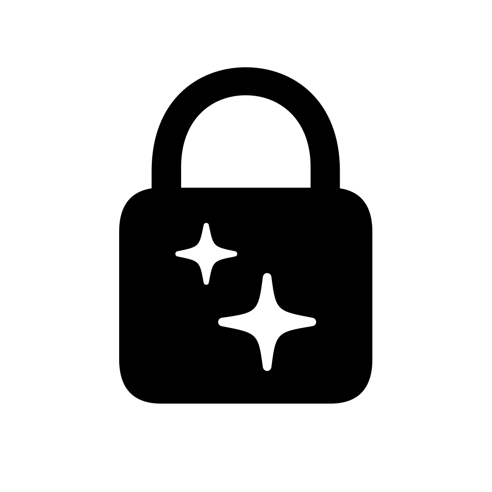

# Cleanlock

  

一个极简的 macOS 屏幕清洁小工具

开启后，Cleanlock 会进入全屏黑幕，并临时拦截键盘输入，方便你擦拭 MacBook 屏幕和键盘

## 系统要求

macOS Tahoe 26.0 及更高版本

我爱大玻璃 d(^_^o)

## 下载

前往 [Releases](https://github.com/bailitaotao/cleanlock/releases) 页面下载最新版本

也打包好了最低支持 macOS 12 的安装包，只是不会再做更新维护，体验也会差一些 [Cleanlock.1.1.0-legacy.dmg](https://github.com/bailitaotao/cleanlock/releases/download/v1.1.0/Cleanlock.1.1.0-legacy.dmg)

## 旧系统自行编译

如果你的 macOS 版本没那么早，只是不想要大玻璃，也可自行修改后编译：

> 1. 打开以下三个文件：
> - `ContentView.swift`
> - `CleaningOverlayView.swift`
> - `AccessibilityPermissionView.swift`
> 2. 将按钮样式改为旧系统可用的样式：
>    - 将结构体`Button`的 `.buttonStyle` 修饰符中的`glass`均改成`bordered`
> 3. 在 Xcode 左侧 **Project Navigator** 中选中项目（cleanlock）
> 4. 切换到 **General** 标签页，并将 **Minimum Deployments** 修改为你的系统版本

## 开源协议

本项目采用 MIT License 开源，详情见 [LICENSE](LICENSE)。
