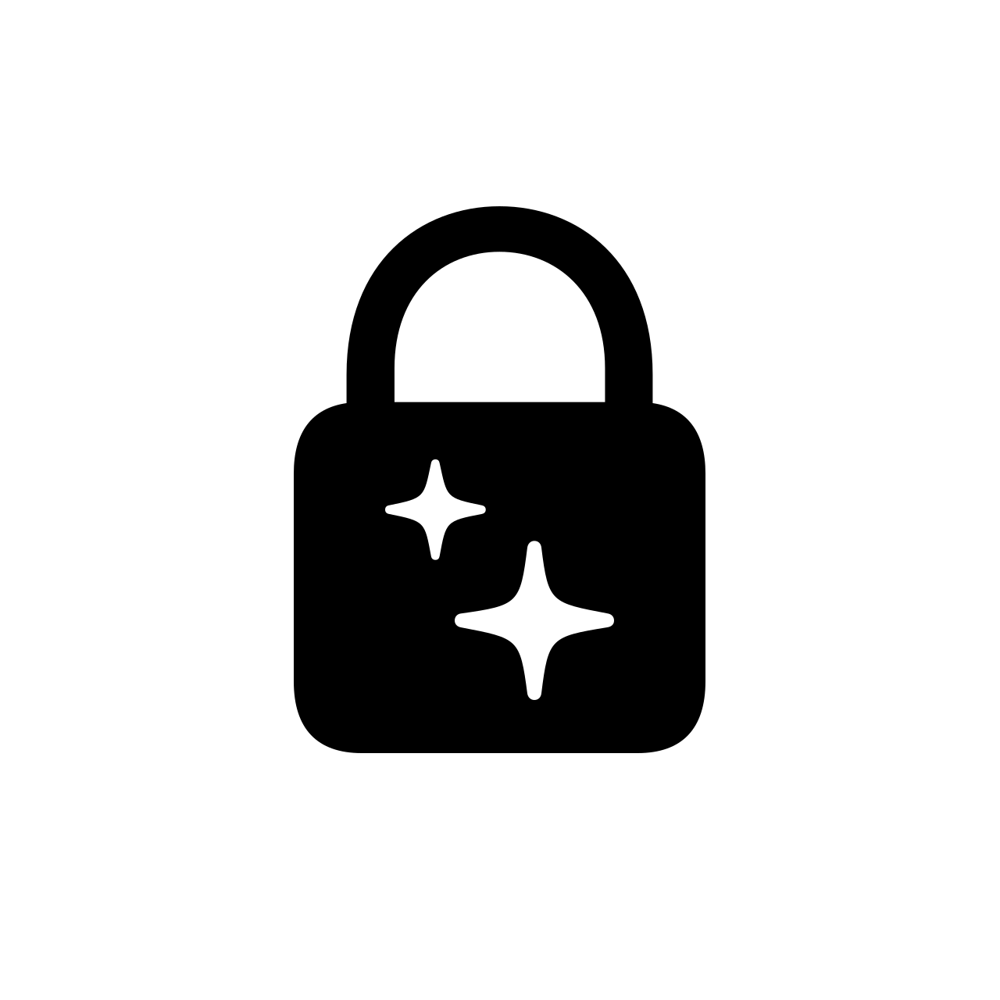
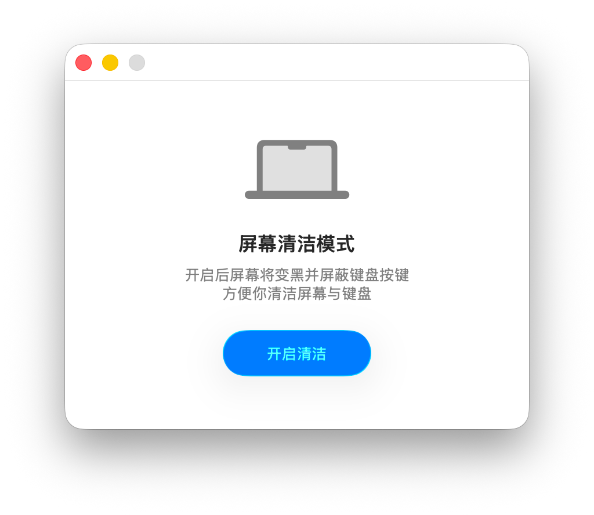

  

# Cleanlock

**A minimal macOS cleaning utility**

Cleanlock turns your screen black and temporarily blocks keyboard input so you can wipe your MacBook screen and keyboard without accidental key presses.

[**English**] | [**简体中文**](./docs/zh-CN/README.md) | [**日本語**](./docs/ja/README.md)

---

## Interface

## System Requirements

macOS Tahoe 26.0 or later

I really like Liquid Glass d(^_^o)

## Download

Download the latest release from the [Releases](https://github.com/bailitaotao/cleanlock/releases) page.

There is also a prebuilt legacy package with minimum support down to macOS 12, but it will no longer receive updates and the experience is a bit worse:
[Cleanlock.1.1.0-legacy.dmg](https://github.com/bailitaotao/cleanlock/releases/download/v1.1.0/Cleanlock.1.1.0-legacy.dmg)

## Build For Older Systems

If your macOS version is not that old and you just do not want the Liquid Glass style, you can still modify the project and build it yourself:

> 1. Open these three files:
> - `ContentView.swift`
> - `CleaningOverlayView.swift`
> - `AccessibilityPermissionView.swift`
> 2. Replace the button styles with ones available on older systems:
>    - Change every `glass` button style used in `.buttonStyle(...)` to `bordered`
> 3. In Xcode, select the project (`cleanlock`) in the left **Project Navigator**
> 4. Open the **General** tab and change **Minimum Deployments** to your target macOS version

## License

This project is released under the MIT License. See [LICENSE](LICENSE) for details.
